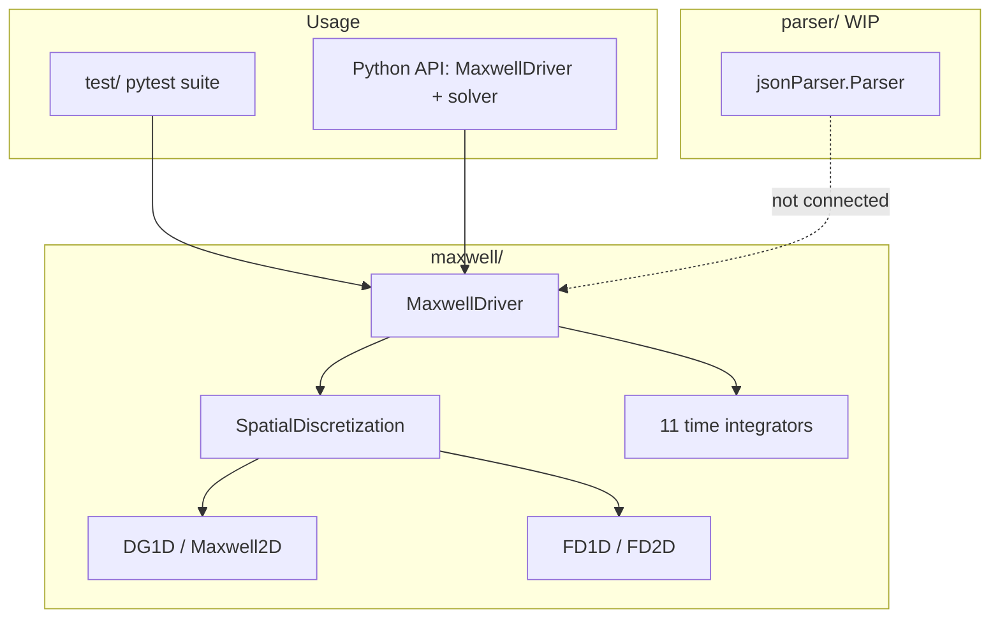

# PyDG1D Capabilities Status Tracker

Experimental Python code for 1D/2D Maxwell solvers using **DGTD** (nodal Discontinuous Galerkin Time Domain) and **FDTD** (Finite-Difference Time Domain). Algorithms are translated from Hesthaven & Warburton, *Nodal Discontinuous Galerkin Methods* (Springer, 2007).

Run the test suite from the repository root:

```bash
pip install -r requirements.txt
python -m pytest test/
```

---

## Status Legend

| Status | Meaning |
|--------|---------|
| **Done** | Implemented and covered by at least one passing test |
| **Partial** | Implemented but incomplete, untested, or only exercised indirectly |
| **Missing** | Referenced in schema, comments, or stubs but not implemented |
| **—** | Not applicable to this solver |

---

## Architecture

PyDG1D is a **library used programmatically** — there is no CLI. The typical usage pattern pairs a spatial discretization with `MaxwellDriver`:

```python
from maxwell.driver import MaxwellDriver
from maxwell.dg.dg1d import DG1D
from maxwell.dg.mesh1d import Mesh1D

sp = DG1D(n_order=3, mesh=Mesh1D(-1, 1, 10, boundary_label="PEC"))
driver = MaxwellDriver(sp, timeIntegratorType='LSERK4', CFL=1.0)
driver.run_until(final_time=1.0)
```



### Module Map

| Module | Path | Role |
|--------|------|------|
| `MaxwellDriver` | [`maxwell/driver.py`](../maxwell/driver.py) | CFL timestep, integrator selection, `step()` / `run()` / `run_until()`, evolution/power/causal operators |
| `SpatialDiscretization` | [`maxwell/spatialDiscretization.py`](../maxwell/spatialDiscretization.py) | Abstract base: field ↔ state vector, local/neighbor indices |
| `DG1D` | [`maxwell/dg/dg1d.py`](../maxwell/dg/dg1d.py) | 1D nodal DG Maxwell solver |
| `dg1d_tools` | [`maxwell/dg/dg1d_tools.py`](../maxwell/dg/dg1d_tools.py) | Jacobi polynomials, Vandermonde, mass/diff matrices, connectivity |
| `Maxwell2D` | [`maxwell/dg/dg2d.py`](../maxwell/dg/dg2d.py) | 2D triangular-element DG Maxwell solver (Hx, Hy, Ez) |
| `dg2d_tools` | [`maxwell/dg/dg2d_tools.py`](../maxwell/dg/dg2d_tools.py) | Simplex nodes, warp factor, geometric factors, grad/curl |
| `Mesh1D` | [`maxwell/dg/mesh1d.py`](../maxwell/dg/mesh1d.py) | Equidistant 1D mesh with per-side boundary labels |
| `Mesh2D` | [`maxwell/dg/mesh2d.py`](../maxwell/dg/mesh2d.py) | Triangle mesh; Gambit `.neu` import |
| `FD1D` | [`maxwell/fd/fd1d.py`](../maxwell/fd/fd1d.py) | Staggered Yee 1D FDTD |
| `FD2D` | [`maxwell/fd/fd2d.py`](../maxwell/fd/fd2d.py) | 2D TE-mode FDTD on structured Cartesian grid |
| Time integrators | [`maxwell/integrators/`](../maxwell/integrators/) | 11 schemes (explicit RK, leapfrog, implicit) |
| `Parser` | [`parser/jsonParser.py`](../parser/jsonParser.py) | Partial JSON problem-description parser (WIP) |
| `utils` | [`parser/utils.py`](../parser/utils.py) | Parser helper types and constants |

There is no `pyproject.toml`, `setup.py`, or `__init__.py` packaging — import `maxwell` directly from the repo root.

---

## Spatial Discretizations

| Capability | DG1D | DG2D (`Maxwell2D`) | FD1D | FD2D |
|------------|------|-------------------|------|------|
| Core RHS / time stepping | Done | Done | Done | Done |
| Polynomial / mesh order | Done (`n_order`) | Done (triangular, `N`) | — | — |
| Per-element materials (ε, σ) | Done | Partial | Partial | Partial |
| Gambit `.neu` mesh import | — | Done | — | — |
| Structured Cartesian grid | — | — | — | Done |
| Upwind / centered flux | Done | Done | — | — |
| Evolution / stiffness operators | Done | Done | Done | Partial |
| Energy analysis | Done | Partial | Done | Partial |
| Field visualization | — | Done (`plot_field`) | — | — |
| State-vector reordering | Done | — | Done | — |

**Notes**

- **DG1D materials**: per-element `epsilon` and `sigma` arrays; tested in dielectric slab and TFG validation tests.
- **DG2D materials**: `epsilon` defaults to ones; source comment notes missing per-element material support (`dg2d.py`).
- **FD1D/FD2D materials**: homogeneous defaults; no per-cell material arrays.
- **DG2D centered flux**: `computeZeroNormalFlux` / `computeTwoNormalFlux` have empty `pass` branches for `"Centered"` flux type (`dg2d.py`).

---

## Boundary Conditions

| BC | DG1D | DG2D | FD1D | FD2D |
|----|------|------|------|------|
| PEC | Done | Done | Done | Done |
| PMC | Done | Partial | Done | Done |
| Periodic | Done | Partial | Done | Missing |
| SMA (simple absorbing) | Done | Partial | — | — |
| ABC | Done | — | — | — |
| Mur (absorbing) | — | — | Done | — |
| Null / Double | Partial | — | — | — |
| TFSF | — | — | Done | Missing |
| Per-side / mixed labels | Done | Partial (global) | Done | Done |

**Notes**

- **DG1D Null/Double**: implemented in `dg1d.py` but not covered by dedicated tests.
- **DG2D boundaries**: single global `boundary_label` string on mesh; no per-face mixed labels.
- **DG2D PMC/SMA/Periodic**: implemented in `fieldsOnBoundaryConditions` but integration tests only exercise PEC (`test_dgtd_2d.py`).
- **FD2D Periodic**: not implemented in `fd2d.py`.
- **FD2D TFSF**: `test/test_fdtd2d_tfsf.py` is a manual plot helper with no pytest test function.

---

## Time Integrators

All 11 schemes are selectable via `timeIntegratorType` in [`maxwell/driver.py`](../maxwell/driver.py).

| Integrator | Type | DG1D tested | DG2D tested | FD tested |
|------------|------|-------------|-------------|-----------|
| `EULER` | Explicit forward Euler | Done | — | — |
| `LSERK4` | Low-storage explicit RK (default) | Done | Partial | Partial |
| `LSERK74` | Low-storage explicit RK | Done | — | — |
| `LSERK134` | Low-storage explicit RK | Done | — | — |
| `LF2` | Leapfrog (staggered) | Done | — | Done |
| `LF2V` | Leapfrog variant | Done | — | — |
| `IBE` | Implicit backward Euler | Done | — | — |
| `CN` | Crank–Nicolson | Done | — | — |
| `DIRK2` | Diagonally implicit RK2 | Done | — | — |
| `IGLRK4` | Implicit Gauss–Legendre RK4 | Partial | — | — |
| `AM2` | Adams–Moulton 2 | Partial | — | — |

**Notes**

- **IGLRK4 / AM2**: wired in `MaxwellDriver` but no dedicated test usage found.
- **DG2D**: `test_dgtd_2d.py` uses default `LSERK4` only.
- **FD**: primary coverage is `LF2`; `test_fdtd_periodic_lserk` exercises default `LSERK4` on FD1D periodic mesh.

---

## Analysis and Validation

| Capability | Status | Test reference |
|------------|--------|----------------|
| Driven evolution operator (`buildDrivedEvolutionOperator`) | Done | `test/tests_fdtd/test_fdtd_1d.py`, `test/test_dgtd_1d.py` |
| Spatial evolution operator (`buildEvolutionOperator`) | Done | `test/dg/test_maxwell1d.py`, `test/dg/test_maxwell2d.py`, `test/fd/test_fd1d.py` |
| Power operator (`buildPowerOperator`) | Done | `test/test_dgtd_1d.py` |
| Causally connected block operators | Done | `test/test_dgtd_1d.py` |
| Field / total energy tracking | Done | `test/dg/test_maxwell1d.py`, `test/test_dgtd_1d.py`, `test/tests_fdtd/test_fdtd_1d.py`, `test/dg/test_maxwell2d.py` |
| Driven evolution operator on DG2D (small mesh) | Done | `test/dg/test_maxwell2d.py` |
| DFT (custom implementation) | Done | `test/test_DFT.py` |
| Slab transmission/reflection vs `scikit-rf` | Done | `test/test_TFG_1single_slab.py`, `test/test_TFG_3multi_slab.py` |
| RK order analysis via `nodepy` | Done | `test/test_dgtd_1d.py` (convergence tests) |
| 2D resonant cavity validation | Done | `test/test_dgtd_2d.py` |

---

## Configuration and I/O

| Feature | Status | Notes |
|---------|--------|-------|
| JSON problem parser | Partial | Only `General` + `Grid` in [`parser/jsonParser.py`](../parser/jsonParser.py) |
| Boundaries parsing | Missing | Commented stub in parser |
| Coordinates parsing | Missing | Commented stub in parser |
| Materials parsing | Missing | Commented stub in parser |
| Sources parsing | Missing | Commented stub in parser |
| Probes parsing | Missing | Commented stub in parser |
| Parser → solver wiring | Missing | No integration path to `MaxwellDriver` |
| Example JSON schema | Partial | [`testData/solver_base.json`](../testData/solver_base.json) (not fully wired) |
| Gambit `.neu` mesh files | Done | [`testData/`](../testData/) fixtures; `Mesh2D.readFromGambitFile` |
| CLI / standalone examples | Missing | Tests serve as usage examples |

---

## Test Coverage Map

**Total: 143 tests** (verified via `python -m pytest test/ --collect-only`).

| Area | Test module(s) | Tests |
|------|----------------|-------|
| DG 1D numerical tools | [`test/dg/test_dg1d.py`](../test/dg/test_dg1d.py) | 26 |
| DG 1D solver unit tests | [`test/dg/test_maxwell1d.py`](../test/dg/test_maxwell1d.py) | 9 |
| DG 1D integration (BCs, integrators, energy) | [`test/test_dgtd_1d.py`](../test/test_dgtd_1d.py) | 35 |
| DG 2D numerical tools | [`test/dg/test_dg2d.py`](../test/dg/test_dg2d.py) | 26 |
| DG 2D solver unit tests | [`test/dg/test_maxwell2d.py`](../test/dg/test_maxwell2d.py) | 7 |
| DG 2D integration | [`test/test_dgtd_2d.py`](../test/test_dgtd_2d.py) | 1 |
| Mesh 1D / 2D | [`test/dg/test_mesh1D.py`](../test/dg/test_mesh1D.py), [`test/dg/test_mesh2D.py`](../test/dg/test_mesh2D.py) | 8 |
| FDTD 1D unit tests | [`test/fd/test_fd1d.py`](../test/fd/test_fd1d.py) | 5 |
| FDTD 1D integration | [`test/tests_fdtd/test_fdtd_1d.py`](../test/tests_fdtd/test_fdtd_1d.py) | 14 |
| FDTD 2D integration | [`test/tests_fdtd/test_fdtd_2d.py`](../test/tests_fdtd/test_fdtd_2d.py) | 4 |
| TFG slab validation | [`test/test_TFG_1single_slab.py`](../test/test_TFG_1single_slab.py), [`test/test_TFG_3multi_slab.py`](../test/test_TFG_3multi_slab.py) | 8 |
| DFT sanity check | [`test/test_DFT.py`](../test/test_DFT.py) | 1 |
| FDTD 2D TFSF (manual only) | [`test/test_fdtd2d_tfsf.py`](../test/test_fdtd2d_tfsf.py) | 0 |

**CI**: GitHub Actions runs `pytest` on Windows and Ubuntu (Python 3.x) — see [`.github/workflows/tests.yml`](../.github/workflows/tests.yml).

---

## Dependencies

From [`requirements.txt`](../requirements.txt):

| Package | Role |
|---------|------|
| `numpy` | Core numerics |
| `scipy` | Linear algebra, implicit solver root-finding (`fsolve`) |
| `matplotlib` | Plotting and animations (mostly in tests) |
| `pytest` | Test runner |
| `nodepy` | Runge–Kutta method coefficients and order analysis |
| `scikit-rf` | Reference S-parameters in slab T/R validation tests |

---

## Known Gaps

- No installable package layout (`pyproject.toml`, `__init__.py` absent).
- JSON parser incomplete and disconnected from solvers.
- 2D TFSF not implemented; `test_fdtd2d_tfsf.py` is a manual script only.
- `IGLRK4` and `AM2` integrators have no test coverage.
- DG2D centered-flux RHS branches are stubs (`pass` in flux helpers).
- DG2D per-element materials not fully implemented.
- FD2D lacks Periodic and TFSF boundary conditions.
- PML mentioned in `mesh1d.py` comments but not implemented.
- Sparse inline API documentation; README is minimal.
- No CLI, examples directory, or user-facing tutorials.

---

## Maintenance

Update this file when adding or changing:

- Spatial solvers (DG/FD, 1D/2D)
- Boundary conditions or material models
- Time integrators
- Parser sections or solver wiring
- Test modules that cover new capabilities

Adjust status markers (**Done** / **Partial** / **Missing**) to match implementation and test evidence.
